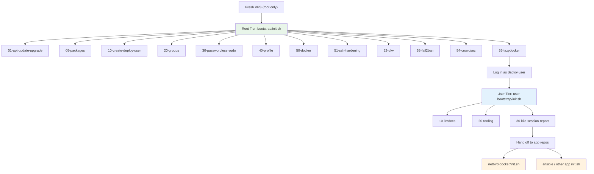
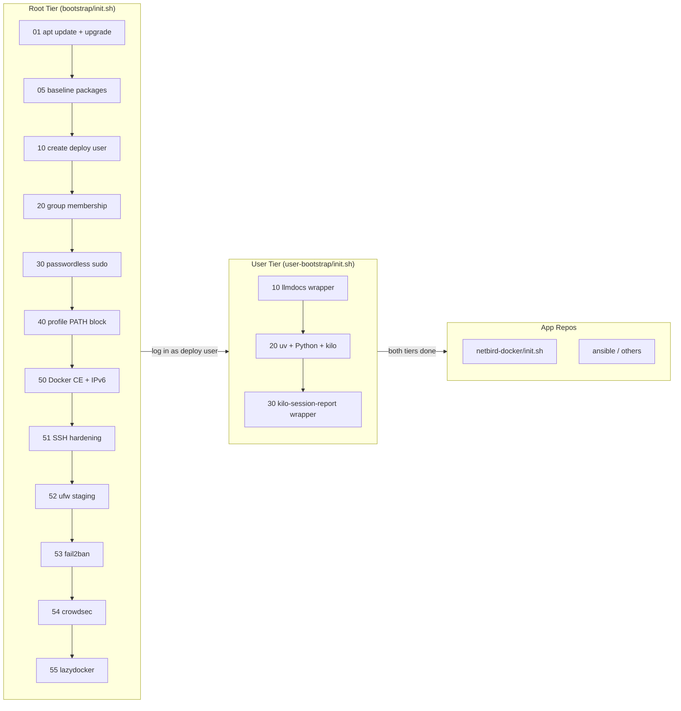
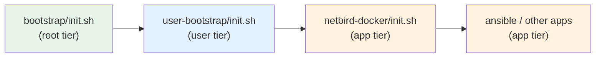

# Bootstrap — Codemap

## System Overview

Bootstrap is a two-tier provisioning system for fresh cloud VPSes (Debian/Ubuntu). The root tier (`bootstrap/init.sh`) transforms a stock machine into a deploy-ready host: apt is updated, baseline packages are installed, a non-root deploy user is created with sudo membership, Docker CE with IPv6 is configured, SSH is hardened, ufw/fail2ban/crowdsec are installed, and `lazydocker` is dropped into the user's `~/.local/bin/`. The user tier (`user-bootstrap/init.sh`) runs as the deploy user and installs per-user tooling: `uv`, a uv-managed Python interpreter, the `kilo` CLI, and wrapper scripts for `llmdocs` and `kilo-session-report`. After both tiers complete, app repositories (e.g. `netbird-docker`, `ansible`) run their own `init.sh` scripts as the deploy user and assume all bootstrap outputs — the deploy user, Docker, groups, PATH entries, and installed tooling — are already in place.

## Tier Model

### Tier Privilege Model

| Aspect | Root Tier | User Tier |
|---|---|---|
| Runner | `bootstrap/init.sh` | `user-bootstrap/init.sh` |
| Runs as | root (via `sudo`) | deploy user (non-root) |
| Refuses | non-root (`EUID != 0`) | root (`EUID == 0`) |
| Steps requiring `SUDO_USER` | `20-groups`, `30-passwordless-sudo`, `40-profile`, `55-lazydocker` | none |
| Install target | `/etc`, `/usr`, system services | `$HOME/.local/bin/`, `$HOME/.local/share/` |
| lib/ | `init.d/lib/env.sh` (EE_ROOT=bootstrap root, toolchain pins), `init.d/lib/common.sh` (root check, apt env vars) | `init.d/lib/env.sh` (EE_ROOT=user-bootstrap root, toolchain pins), `init.d/lib/common.sh` (non-root check) |

### Pipeline Flow

## Root-Tier Step Ownership Table

| Step | Type | What It Installs / Configures | Idempotency Behavior |
|---|---|---|---|
| `01-apt-update-upgrade` | dir | `apt-get update` + `apt-get upgrade -y` | No-op when packages are up to date |
| `05-packages` | dir | Installs packages from `packages.txt`: git, curl, wget, vim, htop, unzip, dnsutils, ca-certificates, sudo, gnupg, gettext-base, jq, openssl, direnv | `apt-get install -y` is a no-op when satisfied; `--force-confdef`/`--force-confold` preserve local config edits |
| `10-create-deploy-user` | dir | Creates deploy user via `useradd -m -s /bin/bash -G sudo`; sets password via `chpasswd` | `useradd` skipped if user exists; `usermod -aG sudo` is idempotent; `chpasswd` always reapplies |
| `20-groups` | dir | Adds `SUDO_USER` to groups from `groups.txt`: adm, docker, sudo, systemd-journal | `groupadd -f` is no-op when group exists; `usermod -aG` is idempotent |
| `30-passwordless-sudo` | dir | Writes `/etc/sudoers.d/99-<user>-passwordless` granting NOPASSWD for: `/usr/bin/systemctl *`, `/usr/bin/docker`, `/usr/bin/docker compose` | Content compared to existing file; skipped if identical; validated with `visudo -c` before write |
| `40-profile` | dir | Writes bootstrap-managed PATH block to `$SUDO_USER/.profile` adding `$HOME/.local/bin` and `$HOME/.kilo/bin` to PATH | Wrapped in BEGIN/END markers; existing block compared and skipped if matching; lone markers cause error; non-marker content preserved |
| `50-docker` | dir | Installs Docker CE, docker-ce-cli, containerd.io, docker-buildx-plugin, docker-compose-plugin from Docker upstream apt repo; writes `/etc/docker/daemon.json` (iptables, ip6tables, userland-proxy off, IPv6 with fixed-cidr-v6); writes `/etc/sysctl.d/99-docker-ipv6.conf`; enables/starts docker | `apt-get install -y` is idempotent; `daemon.json` rewritten each run; does NOT restart running docker (manual restart required after config change) |
| `51-ssh-hardening` | dir | Patches `/etc/ssh/sshd_config` (PermitRootLogin no, X11Forwarding no); installs `/etc/ssh/sshd_config.d/60-hardening.conf` (PermitRootLogin no, X11Forwarding no, AllowUsers stack, MaxAuthTries 3, LoginGraceTime 20); reloads sshd | `sed -i` only replaces when insecure defaults present; drop-in overwritten each run; post-condition assertions via `sshd -T` |
| `52-ufw` | dir | Disables LLMNR via `/etc/systemd/resolved.conf.d/no-llmnr.conf`; installs ufw; stages rules: default deny incoming, allow outgoing, SSH from 170.203.0.0/16, deny 5355 TCP/UDP; does NOT enable ufw | `ufw rule` commands are idempotent (skip existing); drop-in overwritten each run |
| `53-fail2ban` | dir | Installs fail2ban; writes `/etc/fail2ban/jail.local` (sshd, caddy-auth, netbird-installer jails); writes `/etc/fail2ban/filter.d/caddy-auth.conf` and `netbird-installer.conf`; enables/starts fail2ban | Config files overwritten each run; jails tolerate missing log paths at startup |
| `54-crowdsec` | dir | Registers CrowdSec apt repo via `install.crowdsec.net`; installs crowdsec + crowdsec-firewall-bouncer-iptables; installs crowdsecurity/sshd and crowdsecurity/caddy collections; appends Caddy log path to `/etc/crowdsec/acquis.yaml`; enables/starts both services | Apt repo script overwrites existing sources; `cscli collections install` skips already-installed; acquis.yaml append skipped if path already present |
| `55-lazydocker` | dir | Downloads lazydocker tarball from GitHub, verifies SHA256, installs binary to `$SUDO_USER/.local/bin/lazydocker` | Version detected via `lazydocker --version`; reinstall only on mismatch; pinned at `v0.25.2` |

**Root-tier step count: 12** (01, 05, 10, 20, 30, 40, 50, 51, 52, 53, 54, 55)

## User-Tier Step Ownership Table

| Step | Type | What It Installs / Configures | Idempotency Behavior |
|---|---|---|---|
| `10-llmdocs` | dir | Writes `$HOME/.local/bin/llmdocs` wrapper: `exec uv run --project <llmdocs dir> python -m llmdocs "$@"` | Wrapper rewritten each run (path may change if repo relocated) |
| `20-tooling` | dir | Three sub-installs: (1) `uv` via official installer at `$HOME/.local/bin/uv`, (2) Python via `uv python install` under `~/.local/share/uv/python/`, (3) `kilo` CLI binary at `$HOME/.local/bin/kilo` from GitHub release (arch-aware: x64/arm64, baseline/musl variants, SHA256 verified via release JSON) | Each sub-tool independently version-checked; `uv --version`, `uv python list --only-installed`, `kilo --version`; only mismatched tools are installed |
| `30-kilo-session-report` | dir | Writes `$HOME/.local/bin/kilo-session-report` wrapper: `exec uv run --script <path>/kilo-session-report.py "$@"` | Wrapper rewritten each run |

**User-tier step count: 3** (10, 20, 30)

## User-Tier Tools (20-tooling)

### Version Pins

| Tool | Version Pin | Source | Binary Location |
|---|---|---|---|
| `uv` | `0.8.13` | `https://github.com/astral-sh/uv/releases/download/${EE_UV_VERSION}/uv-installer.sh` | `$HOME/.local/bin/uv` |
| Python (CPython) | `3.14` | `uv python install` | `~/.local/share/uv/python/cpython-3.14-.../bin/` (not on PATH) |
| `kilo` | `v7.4.1` | `https://github.com/Kilo-Org/kilocode/releases/download/${KILO_VERSION}/kilo-linux-{x64\|arm64}{-baseline}{-musl}.tar.gz` | `$HOME/.local/bin/kilo` |

### Install Details

- **uv**: Downloaded via official `uv-installer.sh` with `--no-modify-path` flag. No apt dependency.
- **Python**: Installed via `uv python install`. Lives under `~/.local/share/uv/python/`. Callers use `uv run` rather than bare `python3`.
- **kilo**: Downloaded from GitHub release JSON with SHA256 verification (digest extracted from `.assets[].digest`). Architecture detection: `x86_64` → `linux-x64`, `aarch64` → `linux-arm64`. AVX2 check on x64 (falls back to `-baseline`). musl check via `/etc/alpine-release` or `ldd --version` (adds `-musl` suffix).

### Wrapper Tools (not version-pinned binaries)

| Wrapper | Target | Invocation |
|---|---|---|
| `$HOME/.local/bin/llmdocs` | `user-bootstrap/llmdocs/` framework | `uv run --project <llmdocs root> python -m llmdocs` |
| `$HOME/.local/bin/kilo-session-report` | `user-bootstrap/kilo-session-report.py` | `uv run --script <path>/kilo-session-report.py` |

## Relationship to App Repos

Bootstrap is a **prerequisite** — app repos (`netbird-docker`, `ansible`, etc.) run after both tiers complete and assume the following outputs:

### What Bootstrap Provides

| Output | Consumed By | Details |
|---|---|---|
| Deploy user (from `10-create-deploy-user`) | All app repos | Non-root account with sudo membership; app `init.sh` scripts run as this user |
| Docker CE + Compose plugin (from `50-docker`) | `netbird-docker` | Docker daemon running with IPv6, `daemon.json` configured, `docker compose` available |
| Group membership: docker, adm, sudo, systemd-journal (from `20-groups`) | All app repos | Non-root docker access, log reading without sudo |
| Passwordless sudo for systemctl/docker (from `30-passwordless-sudo`) | App init scripts | Apps can manage services and containers without interactive password prompts |
| `$HOME/.local/bin` on PATH (from `40-profile`) | All app repos + user-tier wrappers | Wrappers installed by user-tier are callable by name |
| Baseline packages: jq, openssl, gettext-base, curl, git (from `05-packages`) | All app repos | `jq` for JSON parsing, `openssl` for secrets, `gettext-base` for `envsubst` template rendering, `curl`/`git` for downloads |
| ufw + fail2ban + crowdsec (from `52-ufw`, `53-fail2ban`, `54-crowdsec`) | `netbird-docker` | fail2ban jails reference `/home/stack/netbird-docker/logs/caddy/access.log`; crowdsec acquis.yaml references the same path |
| SSH hardening (from `51-ssh-hardening`) | All app repos | `AllowUsers stack` restricts SSH access |
| uv + Python 3.14 (from `20-tooling`) | `llmdocs`, `kilo-session-report`, app Python tooling | `uv run` is the preferred Python execution method |
| kilo CLI (from `20-tooling`) | Agent-tuner workflow, `kilo-session-report` | Native binary for Kilo sessions |
| llmdocs framework (from `10-llmdocs`) | Docs-source repos | Repo-agnostic docs-to-markdown conversion |

### Execution Order

### Completeness Verification

| Tier | Expected Steps | Found in Source | Status |
|---|---|---|---|
| Root (init.d/) | 01, 05, 10, 20, 30, 40, 50, 51, 52, 53, 54, 55 = **12 steps** | 01-apt-update-upgrade, 05-packages, 10-create-deploy-user, 20-groups, 30-passwordless-sudo, 40-profile, 50-docker, 51-ssh-hardening, 52-ufw, 53-fail2ban, 54-crowdsec, 55-lazydocker = **12 steps** | All accounted for |
| User (user-bootstrap/init.d/) | 10, 20, 30 = **3 steps** | 10-llmdocs, 20-tooling, 30-kilo-session-report = **3 steps** | All accounted for |
| **Total** | **15 steps** | **15 steps** | Complete |
