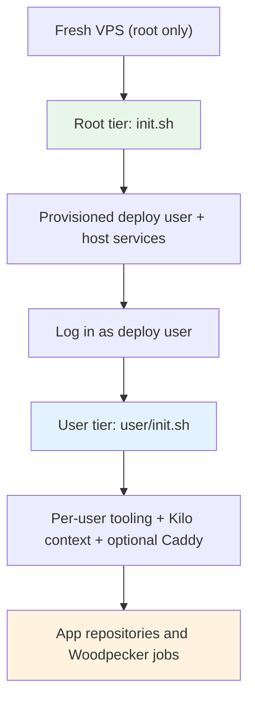
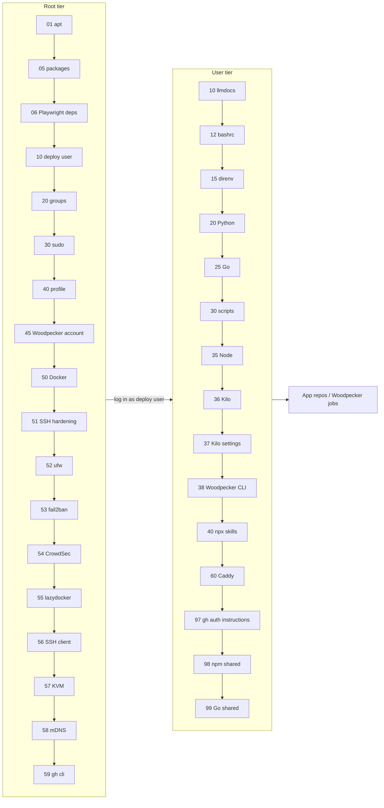
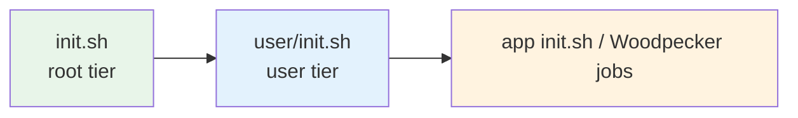

# Bootstrap — Codemap

## System Overview

Bootstrap is a two-tier provisioning system for fresh Debian/Ubuntu cloud VPSes.
The root tier (`init.sh`) provisions the host: apt, baseline packages, the deploy
user and groups, Docker, SSH and firewall hardening, optional virtualization and
IPS tooling, mDNS, and a dedicated Woodpecker local-backend account. The user
tier (`user/init.sh`) runs as the deploy user and installs per-user tooling,
Kilo configuration, agent skills, shared-repository access, Woodpecker CLI, and
the optional central Caddy stack.

Both runners discover flat `NN-name.sh` files and directory steps containing
`run.sh`, sort them numerically, support `--from` and single-step selectors, and
skip disabled steps. A step-local `.requires` file gates optional capabilities.
Steps without `.requires` always run. The root and user runners resolve the same
configuration, preferring `<hostname>.conf.yml` over `bootstrap.conf.yml`, and
export the selected path as `BOOTSTRAP_CONFIG_FILE`.

## Tier Model

### Tier Privilege Model

| Aspect | Root tier | User tier |
|---|---|---|
| Runner | `bootstrap/init.sh` | `user/init.sh` |
| Runs as | root, normally via `sudo` | deploy user, never root |
| Install target | `/etc`, `/usr`, system services, root-owned service accounts | `$HOME/.local/`, `$HOME/.config/`, `$HOME/.kilo/`, `$HOME/infra/` |
| Shared config | `init.d/lib/conf.sh` | sources `../init.d/lib/conf.sh` through user `lib/common.sh` |
| Root-only dependencies | apt, system accounts, Docker, sshd, ufw, fail2ban, CrowdSec | nvm/Node, uv/Python, Go, npm, Kilo, user config |

## Pipeline Flow

## Capability Configuration

Capabilities are parsed by `init.d/lib/conf.sh`. If a config file exists,
capabilities not listed in it are enabled; if the config file is missing, all
capabilities are disabled and version pins default to `latest`.

| Capability | Gated steps |
|---|---|
| `docker` | `init.d/50-docker`, `init.d/55-lazydocker`, `user/init.d/60-caddy` |
| `caddy` | `user/init.d/60-caddy` (also requires `docker`) |
| `kvm` | `init.d/57-kvm` |
| `dev` | `init.d/06-playwright-deps`, `user/init.d/98-npm-shared`, `user/init.d/99-go-shared` |
| `public` | `init.d/54-crowdsec`; also enables CrowdSec integration in `60-caddy` when present |

The example configuration also contains `versions:` pins for `uv`, `python`,
`kilo`, `go`, and `node`; `skills.agents` for explicit `npx skills` targets;
and `caddy.base_domain` plus `caddy.wildcards` for wildcard zone rendering.

## Root-Tier Step Ownership

| Step | What it installs or configures |
|---|---|
| `01-apt-update-upgrade` | Refreshes apt indexes and applies pending upgrades. |
| `05-packages` | Installs baseline packages from `packages.txt`, including curl, git, sudo, jq, openssl, gettext-base, direnv, and build tools. |
| `06-playwright-deps` | Installs distro-specific shared libraries required by Chromium, Firefox, and WebKit. Unknown distros are skipped with instructions. Requires `dev`. |
| `10-create-deploy-user` | Creates the configured non-root deploy user, home, shell, and sudo membership; applies the bootstrap password. |
| `20-groups` | Adds the invoking deploy user to groups listed in `groups.txt`: `adm`, `docker`, `sudo`, and `systemd-journal`. |
| `30-passwordless-sudo` | Manages a validated sudoers drop-in for systemctl, Docker, and CrowdSec administration. |
| `40-profile` | Adds the marker-guarded PATH block for `~/.local/bin` and `~/.kilo/bin` to the deploy user’s `~/.profile`. |
| `45-woodpecker-local` | Creates the unprivileged `woodpecker` service account and home, then runs selected user-tier toolchain steps for that account; installs `plugin-git`. |
| `50-docker` | Installs Docker CE, Compose/buildx plugins, and configures dual-stack IPv4/IPv6 daemon settings. Requires `docker`. |
| `51-ssh-hardening` | Applies sshd hardening, an `AllowUsers` policy, and post-change `sshd -T` assertions. |
| `52-ufw` | Installs ufw, disables LLMNR, and stages deny-incoming/allow-outgoing plus SSH and Docker/CrowdSec rules without enabling ufw. |
| `53-fail2ban` | Installs fail2ban and manages SSH, Caddy-auth, and NetBird-installer jails and filters. |
| `54-crowdsec` | Installs CrowdSec and its firewall bouncer, collections, Caddy log acquisition, LAPI configuration, and the Docker-bridge ufw rule. Requires `public`. |
| `55-lazydocker` | Downloads and SHA256-verifies the pinned lazydocker release into the deploy user’s `~/.local/bin/`. Requires `docker`. |
| `56-ssh-client` | Manages deploy-user SSH defaults, `hosts.d` inclusion, and stale ControlMaster cleanup. |
| `57-kvm` | Installs and configures the KVM/libvirt virtualization stack. Requires `kvm`. |
| `58-mdns` | Enables private-interface mDNS through nsswitch and Avahi while excluding public uplinks. |
| `59-gh-cli` | Installs GitHub CLI from the official signed Debian repository; authentication remains a separate per-user operation. |

**Root-tier step count: 18** (01, 05, 06, 10, 20, 30, 40, 45, 50, 51, 52,
53, 54, 55, 56, 57, 58, 59).

## User-Tier Step Ownership

| Step | What it installs or configures |
|---|---|
| `10-llmdocs` | Deploys the llmdocs framework and its `~/.local/bin/llmdocs` wrapper. |
| `12-bashrc` | Adds the managed PATH block to `~/.bashrc` for non-login interactive shells. |
| `15-direnv` | Adds the direnv Bash hook and creates the profile-level direnv scaffold. |
| `20-python` | Installs uv and a uv-managed CPython according to version pins. |
| `25-go` | Installs Go, shell environment, persistent Go settings, and development tools under `~/go/bin/`. |
| `30-scripts` | Syncs repository scripts to `$HOME/scripts/` (including the interactive `github-access` helper and the capability-driven `bootstrap-access` walk), installs their local wrappers, deploys the air skill, and ships the canonical `templates/air.toml.template`. |
| `35-node` | Installs nvm and pinned Node.js, global npm packages, and Playwright browsers. |
| `36-kilo` | Installs `@kilocode/cli` from npm and removes stale legacy Kilo installations. |
| `37-kilo-settings` | Syncs global Kilo agents, commands, rules, skills, MCP configuration, permissions, and bootstrap `.kilocodeignore`, preserving user customizations. |
| `38-woodpecker-cli` | Installs the pinned Woodpecker CLI into `~/.local/bin/`. |
| `40-npx-skills` | Installs the configured general, frontend, and UI engineering skills through `npx skills` for explicit agents. |
| `60-caddy` | Provisions `~/infra/caddy`, the `edge` network, central Caddy files, wildcard snippets, `caddy-route`, and the central-caddy skill. Requires `docker` and `caddy`; never starts a stopped stack. |
| `97-gh-auth-instructions` | Points operators to the interactive `~/scripts/bootstrap-access` walk (and the underlying `github-access` helper); does not authenticate or modify credentials. |
| `98-npm-shared` | Requires `dev`; configures and verifies GitHub Packages npm auth for `@broadminde-org/*` when `BROADMINDE_PACKAGES_TOKEN` (or legacy `GITHUB_PACKAGES_TOKEN`) is present. |
| `99-go-shared` | Requires `dev`; creates dedicated read-only GitHub deploy keys, registers them through `gh api` when authenticated and authorized, manages known-host files, SSH aliases, Git URL rewrites, and verifies both shared repositories. |

**User-tier step count: 15** (10, 12, 15, 20, 25, 30, 35, 36, 37, 38, 40,
60, 97, 98, 99).

## Version Pins and Shared Access

Version pins live in `bootstrap.conf.yml` under `versions:` and are exported by
the user common library. Supported tools are `uv`, `python`, `kilo`, `go`, and
`node`; `latest`, major, major.minor, and exact pins are supported where the
individual step documents them. Environment variables override configuration.

The `dev` capability deliberately gates only development-node extras, not the
core user tier. `98-npm-shared` consumes `BROADMINDE_PACKAGES_TOKEN` from the
repo root `.env`, with legacy `GITHUB_PACKAGES_TOKEN` as a fallback; the
interactive `github-access packages [--write]` helper validates and stores the
classic PAT. GitHub Packages' npm registry requires a classic PAT, and `gh`
cannot mint a separate PAT. `github-access source-rw` manages the optional
`BROADMINDE_SOURCE_RW_TOKEN` (`repo`, `workflow`) for CI/update hosts that push
source changes and create issues or PRs. `99-go-shared` generates separate keys
for `broadminde-org/go-shared` and `broadminde-org/frontend-shared`, uses
`gh api` to create matching read-only deploy keys when the authenticated
operator has permission, and then verifies access with `git ls-remote`.

Interactive post-bootstrap credential setup is orchestrated by
`~/scripts/bootstrap-access` (no arguments). It loads the active conf, walks
each enabled capability that needs credentials — `gh` login, then `dev` (via
`github-access`), then `caddy` (ACME email in `~/infra/caddy/.env`, acme-dns
registration when `caddy.wildcards` is non-empty) — verifying current state
before prompting so re-runs are idempotent. Capabilities with no interactive
credentials (`docker`, `kvm`, `public`) are reported and skipped.

## Relationship to App Repositories

Bootstrap is a prerequisite for app repositories and Woodpecker jobs. It
provides the deploy user, Docker and Compose, group membership, passwordless
service administration, PATH setup for login and non-login shells, SSH defaults,
baseline packages, optional host security services, uv/Python, Go, Node/npm,
Kilo, shared-repository access, and the central Caddy discovery and routing
tools. The Woodpecker local-backend account additionally receives its own home,
toolchain, CLI, and `plugin-git` binary.

## Completeness Verification

| Tier | Expected steps | Found in source | Status |
|---|---|---|---|
| Root (`init.d/`) | 01, 05, 06, 10, 20, 30, 40, 45, 50, 51, 52, 53, 54, 55, 56, 57, 58, 59 = **18** | Same 18 directory steps, plus `lib/` (library, not a step) | All accounted for |
| User (`user/init.d/`) | 10, 12, 15, 20, 25, 30, 35, 36, 37, 38, 40, 60, 97, 98, 99 = **15** | Same 15 directory steps, plus `lib/` (library, not a step) | All accounted for |
| **Total executable steps** | **33** | **33** | Complete |
