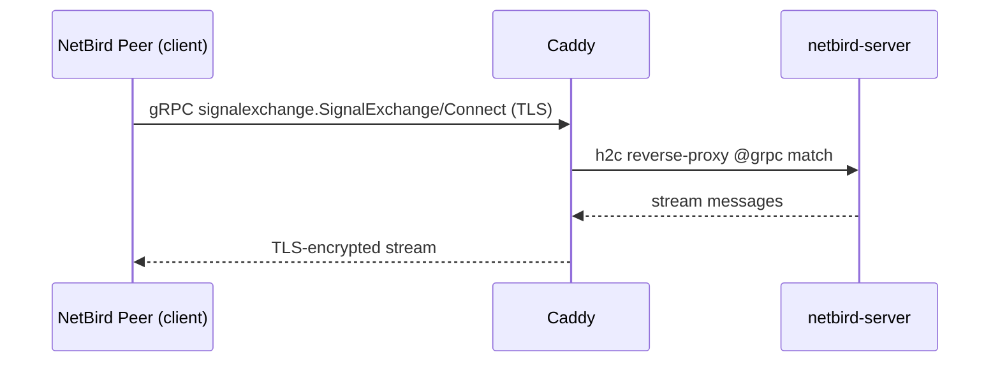
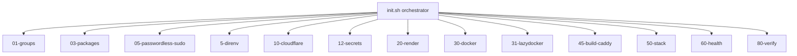

## Mermaid Diagram Generation

### Flowchart LR (Compose Stack Layering)

**When to use**: `ARCHITECTURE.md` needs a layering diagram of the docker-compose stack.

**Steps**:
1. Read `docker-compose.yml` to identify each service and its reverse-proxy target.
2. Read `Caddyfile` to map Caddy matcher blocks (`@grpc`, `@gprc`, `@websocket`, `@backend`,
   default `/*`) to upstream services.
3. Label each node with its actual service name from the compose file.
4. Draw left-to-right: External client -> Caddy (TLS) -> reverse-proxied services.

**Example**:
```mermaid
flowchart LR
    Client[External Client]
    Caddy["caddy\n(TLS, reverse proxy)"]
    NB["netbird-server\n(signal/management/relay)"]
    Dash["dashboard\n(web admin)"]

    Client -->|HTTPS| Caddy
    Caddy -->|@grpc,@gprc,@websocket,@backend| NB
    Caddy -->|default /*| Dash
```

### Sequence Diagram (gRPC signal exchange)

**When to use**: `ARCHITECTURE.md` needs a peer handshake / signal flow.

**Steps**:
1. Read `Caddyfile` to confirm gRPC traffic is on `/signalexchange.SignalExchange/*`
   and `/management.ManagementService/*` matchers.
2. Label participants: Client, Caddy (TLS), NetBirdServer.
3. Show TLS termination, reverse-proxy match, gRPC stream lifecycle.

**Example**:


### Sequence Diagram (REST / Dashboard)

**When to use**: `ARCHITECTURE.md` or `codemap-config.md` needs an HTTP request flow.

**Steps**:
1. Identify whether the request hits `@backend` (`/relay*`, `/api/*`, `/oauth2/*`) or the
   default `/*` (dashboard static).
2. Label participants accordingly.
3. Show the OIDC callback path under `/oauth2/*` when relevant.

### Graph TD (init.d Pipeline)

**When to use**: `codemap-pipeline.md` needs an execution order diagram.

**Steps**:
1. List every numbered step from `init.d/` in lexical order.
2. Identify the orchestrator: `init.sh`.
3. Draw top-down: `init.sh` -> each numbered step in sequence.
4. Use `subgraph` zones for the host tier (root-required) vs app tier (deploy user).

**Example**:


### Graph TD (Caddyfile Route Map)

**When to use**: `codemap-config.md` needs a visualization of which Caddy matcher
sends traffic where.

**Steps**:
1. List every named matcher (`@grpc`, `@gprc`, `@websocket`, `@backend`) plus the default `/*`.
2. Label nodes with the upstream service and the matcher / path condition.
3. Group matchers by upstream service with `subgraph` if helpful.

### General Syntax Rules

For escaping, quoting, and validation rules, see the `mermaid-standards` rule. Do not
duplicate those constraints here.
